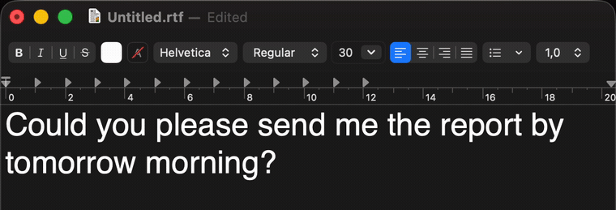

<div align="center">


# Easy Write on Mac

### Translate & rewrite text anywhere on your Mac — formal or informal — 100% on-device.

Select text in any app, press a shortcut, and it's **instantly replaced with the translation** —
in the register you choose (German *Sie* vs *du*, French *vous* vs *tu*, …). Powered entirely by
Apple's **on-device** model (Apple Intelligence / Foundation Models). **No accounts. No API keys.
No cloud.** Your text never leaves your Mac.

A free, open-source **DeepL / Google Translate alternative** for macOS — built for people who
write and read in more than one language.


**[🧠 How it works](HOW_IT_WORKS.md) · [⬇️ Install](#-install-build-from-source) · [🆚 How it compares](#-how-it-compares) · [🐛 Report a bug / request a feature](../../issues)**



</div>

---

## Why Easy Write?

If you write emails, messages, or docs in a language that isn't your first, you're stuck in a loop:
copy → open DeepL/Google Translate → paste → translate → copy → paste back. And the result often gets
the *words* right but the **tone** wrong — which in German (and French, Spanish, Italian…) is the
difference between polite and rude.

Two things go wrong with the existing options:

- 🌐 **Cloud translators** (DeepL, Google Translate) mean sign-ups, monthly limits, and your private
  text leaving your machine. The "translate in any app" desktop tools are mostly the same — cloud
  behind a popup.
- 🧩 **Local LLM tools** get privacy right but make you install Ollama, download a model, or paste in
  an OpenAI API key first.

**Easy Write uses the LLM already built into macOS 26** — so it's private *and* zero-setup, and it
understands formality, which a plain dictionary translator can't.

## What you get

- ⚡ **Translate in place** — select → shortcut → the selection is replaced with the translation, in any app
- 🗣️ **Formal / informal** — one keystroke for German *Sie* vs *du*, French *vous* vs *tu*, Spanish *usted* vs *tú*…
- 📖 **Read mode** — translate incoming foreign text *to English* in a popup (for web pages, emails, chats you can't edit)
- 🌍 **12 languages** — German, French, Spanish, Italian, Portuguese, Dutch, Turkish, Polish, Russian, English, Japanese, Chinese
- 🧠 **Personal style & glossary** — teach it your preferred terms so the output sounds like *you*
- ⌨️ **Custom shortcuts** — rebind every action
- 🔒 **100% local** — no account, no API key, no telemetry, zero network code
- 🪶 **Tiny & native** — a ~600-line Swift menu-bar app, no Dock clutter, launches at login

## 🆚 How it compares

The honest version: these tools are good — Easy Write just occupies a different corner (free, private,
zero-setup, register-aware).

| | **Easy Write** | DeepL | Google Translate | Apple Translate | Ollama-based tools |
|---|:---:|:---:|:---:|:---:|:---:|
| Runs on-device / private | ✅ | ❌ cloud | ❌ cloud | ✅ | ✅ |
| No account or API key | ✅ | ❌ | ⚠️ | ✅ | ⚠️ needs setup |
| Formal vs informal (Sie/du) | ✅ | Pro only | ❌ | ❌ | ✅ |
| Replace selection in place | ✅ | app only | ❌ | ✅ | varies |
| Works in any app | ✅ | ✅ | ❌ | ⚠️ some | ✅ |
| Setup | just the app | account | — | built-in | install Ollama + model |
| Open source | ✅ | ❌ | ❌ | ❌ | ✅ |
| Price | **Free** | Free / Pro | Free | Free | Free |

## Requirements

- **macOS 26 (Tahoe) or later**, **Apple Silicon**
- **Apple Intelligence enabled** — System Settings → *Apple Intelligence & Siri*

## ⬇️ Install (build from source)

```bash
git clone https://github.com/onekapisch/easy-write.git
cd easy-write
./setup-signing.sh      # one-time: a stable self-signed identity so the Accessibility grant sticks
./build.sh              # compile + bundle + sign  →  EasyWrite.app
cp -R EasyWrite.app /Applications/
open /Applications/EasyWrite.app
```

Then **grant Accessibility** when prompted (or menu-bar icon → *Accessibility Settings…*). That's the
permission that lets Easy Write read your selection and paste the result. Done — select text and press
a shortcut.

## Usage

| Shortcut | Action |
|:---:|---|
| `⌥⌘T` | Translate to **formal** (Sie / vous / usted…) |
| `⌥⌘I` | Translate to **informal** (du / tu / tú…) |
| `⌥⌘P` | **Plain** translation (keeps the source's natural tone) |
| `⌥⌘E` | **Read → English** (popup, for text you can't edit) |

Set the target language, rebind shortcuts, add a personal style guide, and toggle
preview-before-replace in **Preferences** (menu-bar icon → *Preferences…*).

## 🔒 Privacy & security

Nothing leaves your Mac. The model runs locally; there is **no network code, no analytics, no
accounts**. The only permission required is **Accessibility** — to read your current selection
(synthesised ⌘C) and paste the translation back (⌘V). Your clipboard is snapshotted and restored
around every swap. Don't take our word for it — the whole app is ~600 lines of Swift. Read it.

See [SECURITY.md](SECURITY.md) for the full data-flow and how to report a vulnerability.

## 🧠 How it works

See **[HOW_IT_WORKS.md](HOW_IT_WORKS.md)** — the on-device LLM integration, the permissive-guardrails
gotcha (Apple's default safety filter blocks ordinary translations!), the system-wide inline swap via
synthesised keystrokes, and the code-signing trick that keeps the Accessibility grant alive across rebuilds.

## Roadmap

Preview-before-replace for every mode · translation history · more languages · a notarized
prebuilt download. Ideas and PRs welcome — open an [issue](../../issues).

## FAQ

**Is it really free?** Yes — free and open source (MIT). No account, no subscription, no upsell.

**Does it send my data anywhere?** No. There is zero network code. Everything runs on-device.

**Why does it need Accessibility permission?** To read your current selection and paste the
translation back. That's the only way to work in *every* app, not just one.

**Why not the Mac App Store?** Posting synthetic keystrokes is incompatible with App Store sandboxing,
so it's distributed build-from-source (a notarized download may come later).

**"Apple Intelligence isn't available."** Enable it in System Settings → *Apple Intelligence & Siri*
(requires Apple Silicon + macOS 26).

**How is this different from Apple's built-in Translate?** Apple's right-click Translate opens a
separate popover you copy from, and it can't do formal vs. informal. Easy Write swaps the text in
place and is register-aware.

## Contributing

PRs and issues welcome — see [CONTRIBUTING.md](CONTRIBUTING.md). Good first contributions: more
languages, translation history, long-text handling.

## License

[MIT](LICENSE) © onekapisch

---

<div align="center">

⭐ **If Easy Write saves you a trip to a translation site, star the repo — it genuinely helps other people find it.**

Made with Swift + Apple's on-device intelligence · No cloud, no accounts, no tracking.

</div>
